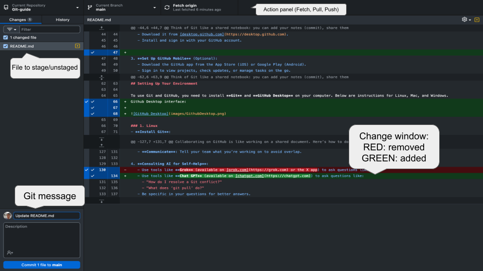

# Welcome to the Git and GitHub Guide for Beginners

This README is your step-by-step guide to understanding **Git** and **GitHub**, setting up tools, collaborating with a team, and practicing with a hands-on exercise. No programming or computing experience? No problem! We'll walk you through everything in simple terms.

## Table of Contents
1. [What is Git?](#what-is-git)
2. [What is GitHub?](#what-is-github)
3. [Setting Up Your Environment](#setting-up-your-environment)
4. [Teamwork on GitHub: Best Practices](#teamwork-on-github-best-practices)
5. [Exercise: Clone, Edit, and Push Changes](#exercise-clone-edit-and-push-changes)
6. [Need Help?](#need-help)

---

## What is Git?

**Git** is a tool that helps you keep track of changes to files, like a super-powered "Track Changes" in a document. It’s widely used for teamwork, allowing multiple people to work on the same project without overwriting each other's work.

### Key Git Concepts
- **Repository (abbr. Repo)**: A directory (storage) that is managed by Git to keep track on project's files, history, ...
- **Local**: The Git repository on YOUR computer, where you directly work with the code.
- **Remote**: The online version that your local is linked with, which allows collboration and backup.
- **Git Clone**: Copy a project from an online storage (like GitHub) to your computer.
- **Git Stage**: Select a group of your changes you'd like to deliver together for a purpose (Which you can add a message attached to it)
- **Git Commit**: Save a snapshot of your changes, like saving a version of your work with a note about what you did.
- **Git Merge**: Combine changes from different branches or versions into one.
- **Git Push**: Send your saved changes from your computer to the online storage.
- **Git Fetch**: Check for updates from the online storage without applying them.
- **Git Pull**: Download and apply updates from the online storage to your computer.

Think of Git like a shared notebook: you can add your notes (commit), share them with others (push), check for their notes (fetch), and update your copy (pull).

---

## What is GitHub?

**GitHub** is an online platform where you store and share your Git projects. It’s like a cloud drive for your files, but with tools for teamwork, version tracking, and collaboration.

### Getting Started with GitHub
1. **Create a GitHub Account**:
   - Go to [github.com](https://github.com).
   - Click "Sign Up" and follow the instructions to create an account with your email.
   - Verify your email address to activate your account.

2. **Set Up GitHub Desktop**:
   - GitHub Desktop is a user-friendly app to manage your Git projects.
   - Download it from [desktop.github.com](https://desktop.github.com).
   - Install and sign in with your GitHub account.

3. **Set Up GitHub Mobile** (Optional):
   - Download the GitHub app from the App Store (iOS) or Google Play (Android).
   - Sign in to view projects, check updates, or manage tasks on the go.
   - Use as an account authenticator

4. **Investigate Permissions**:
   - On GitHub, permissions control who can view, edit, or manage a project (called a "repository").
   - If invited to a repository, check your role (e.g., "Write" for editing, "Admin" for full control).
   - To view permissions:
     - Go to the repository on GitHub.
     - Click "Settings" (if visible) > "Collaborators and teams."
     - Ask the repository owner if you’re unsure about your access.

---

## Setting Up Your Environment

To use Git and GitHub, you need to install **Git** and **GitHub Desktop** on your computer. Below are instructions for Linux, Mac, and Windows.
Github Desktop interface: 

### 1. Linux
- **Install Git**:
  - Open a terminal (search for "Terminal" in your system).
  - Run: `sudo apt update && sudo apt install git`
  - Verify installation: `git --version`
- **Install GitHub Desktop**:
  - GitHub Desktop isn’t officially supported on Linux, but you can use alternatives like **GitKraken** or manage Git via terminal.
  - For GitKraken: Download from [gitkraken.com](https://www.gitkraken.com), install, and sign in with GitHub.
- **Configure Git**:
  - In the terminal, set your name: `git config --global user.name "Your Name"`
  - Set your email: `git config --global user.email "your.email@example.com"`

### 2. Mac
- **Install Git**:
  - Open Terminal (search for "Terminal" in Spotlight).
  - Install Git by running: `xcode-select --install` (follow prompts) or download from [git-scm.com](https://git-scm.com).
  - Verify: `git --version`
- **Install GitHub Desktop**:
  - Download from [desktop.github.com](https://desktop.github.com).
  - Drag the app to your Applications folder, open it, and sign in.
- **Configure Git**:
  - In Terminal, set your name: `git config --global user.name "Your Name"`
  - Set your email: `git config --global user.email "your.email@example.com"`

### 3. Windows
- **Install Git**:
  - Download Git from [git-scm.com](https://git-scm.com).
  - Run the installer, accept defaults, and choose your preferred text editor (e.g., Notepad).
  - Verify: Open Command Prompt (search for "cmd") and run `git --version`.
- **Install GitHub Desktop**:
  - Download from [desktop.github.com](https://desktop.github.com).
  - Run the installer, open the app, and sign in.
- **Configure Git**:
  - Open Command Prompt or Git Bash (installed with Git).
  - Set your name: `git config --global user.name "Your Name"` (same as the one you registered on GitHub)
  - Set your email: `git config --global user.email "your.email@example.com"` (same as the one you registered on GitHub)

---

## Teamwork on GitHub: Best Practices

Collaborating on GitHub is like working on a shared document. Here’s how to do it smoothly:

1. **Always Fetch and Pull Before Working**:
   - Before editing, use GitHub Desktop or terminal to **fetch** (check for updates) and **pull** (download updates).
   - In GitHub Desktop: Open your repository, click "Fetch origin," then "Pull origin."
   - This ensures you have the latest changes and avoids conflicts.

2. **Resolving Conflicts**:
   - A conflict happens when two people edit the same part of a file.
   - GitHub Desktop will alert you if there’s a conflict.
   - To resolve:
     - Open the conflicting file in a text editor (e.g., Notepad, VS Code).
     - Look for markers like `<<<<<<<` and `>>>>>>>`. Keep the changes you want and delete the markers.
     - Save, commit, and push the resolved file.
   - Ask a teammate or consult an AI tool (see below) if stuck.

3. **Good Practices**:
   - **Commit Often**: Save small, meaningful changes with clear messages (e.g., "Updated README introduction").
   - **Write Clear Commit Messages**: Explain what you changed and why.
   - **Push Regularly**: Share your changes to avoid losing work.
   - **Communicate**: Tell your team what you’re working on to avoid overlap.

4. **Consulting AI for Self-Help**:
   - Use tools like **Chat GPT** (available on [chatgpt.com](https://chatgpt.com)) to ask questions like:
     - "How do I resolve a Git conflict?"
     - "What does ‘git pull’ do?"
   - Be specific in your questions for better answers.

---

## Exercise: Clone, Edit, and Push Changes

Let’s practice! You’ll clone this repository, edit this README, and push your changes.

### Step 1: Clone the Repository
- **Using GitHub Desktop**:
  - Open GitHub Desktop.
  - Click "File" > "Clone Repository."
  - Select this repository from the list or paste its URL (e.g., `https://github.com/username/repository`).
  - Choose an empty folder on your computer and click "Clone."
- **Using Terminal** (Linux/Mac) or Git Bash (Windows):
  - Run: `git clone https://github.com/username/repository.git`
  - Navigate to the folder: `cd repository`

### Step 2: Edit the README
- Open the `README.md` file in a text editor (e.g., Notepad, TextEdit, or VS Code).
- Add a line at the end of this section, like: `Edited by [Your Name] on [Date].`
- Save the file.

### Step 3: Commit Your Changes
- **In GitHub Desktop**:
  - Open the repository.
  - See your changes listed.
  - Write a commit message (e.g., "Added my name to README").
  - Click "Commit to main."
- **In Terminal/Git Bash**:
  - Run: `git add README.md`
  - Run: `git commit -m "Added my name to README"`

### Step 4: Push Your Changes
- **In GitHub Desktop**:
  - Click "Push origin."
- **In Terminal/Git Bash**:
  - Run: `git push origin main`
- Check GitHub online to see your changes!

**Troubleshooting**:
- If you get a permission error, confirm your role with the repository owner.
- If there’s a conflict, follow the [conflict resolution steps](#teamwork-on-github-best-practices).

---

## Need Help?

- **Ask AI**: Use ChatGPT on [chatgpt.com](https://chatgpt.com) for quick answers.
- **GitHub Docs**: Visit [docs.github.com](https://docs.github.com) for guides.
- **Team**: Reach out to your repository owner or teammates.
- **Community**: Post questions on forums like [stackoverflow.com](https://stackoverflow.com).
